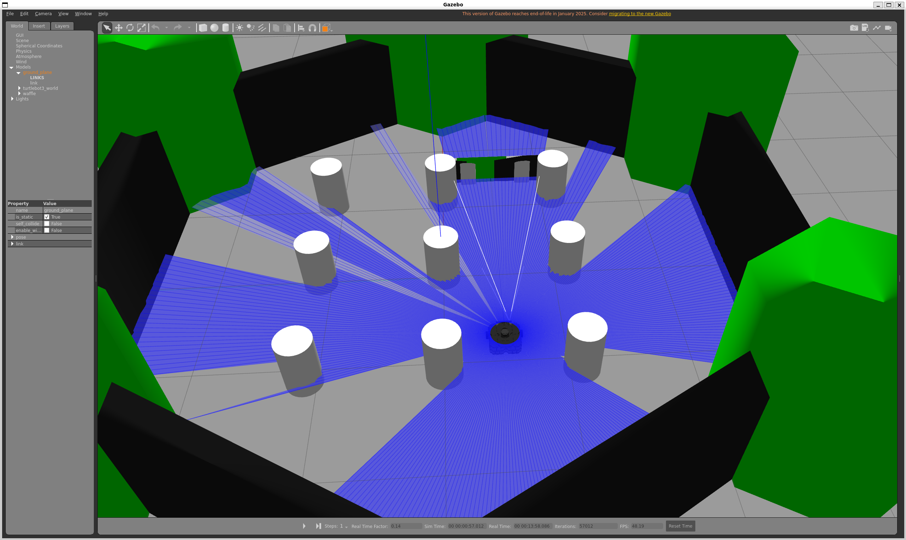
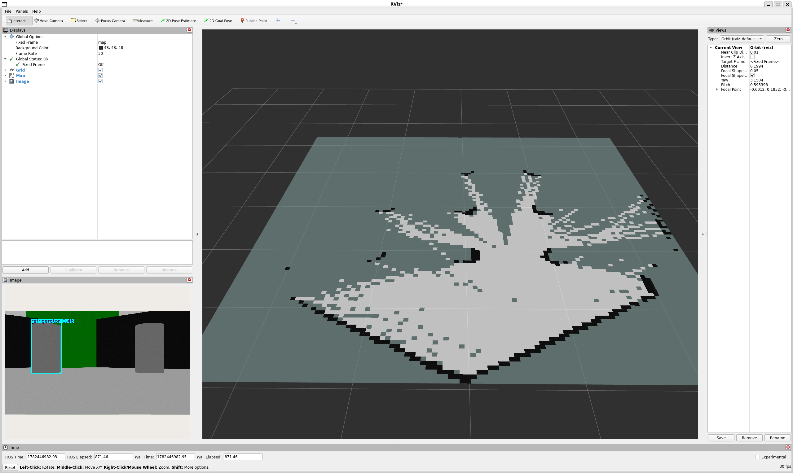

# 🚀 ROS2 SLAM + Vision Perception System

> 基于 ROS2 Humble 的机器人自主感知-建图-导航系统，
> 集成 Gazebo 仿真、slam_toolbox 在线建图、Nav2 自主导航
> 以及 YOLO 实时目标检测。全系统在消费级 GPU 上运行。

  
  

---

## 📋 Overview

| 模块 | 功能 | 技术 |
|------|------|------|
| **Gazebo 仿真** | TurtleBot3 Waffle 物理仿真 + 摄像头 + 激光雷达 | Gazebo 11 |
| **SLAM** | 未知环境实时建图 + 地图持久化 | slam_toolbox |
| **Nav2** | AMCL 定位 + 全局规划 + 局部避障 | Navigation2 |
| **视觉感知** | 实时目标检测 + ROS 话题发布 | YOLOv8n × cv_bridge |

---

## 🏗 System Architecture
